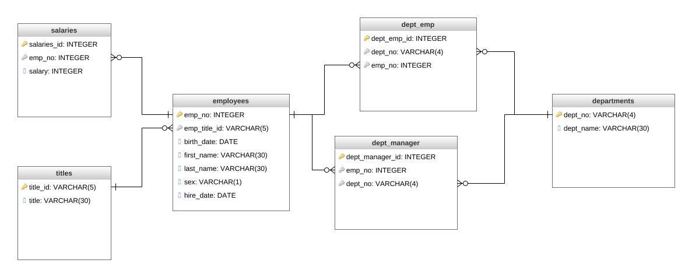

## sql-challenge
# Kristy Anderson
# August 23, 2020
# Data Analytics
# SQL-Challenge Homework

Please view the DatabaseDiagram.png for the entity relationship diagram for this data.

To replicate my work, you can use pgAdmin to connect to Postgres. Once in pgAdmin, find the database employeesSQL_db.
On the employeesSQL_db, query my file named "schema.sql" first and run the code, in the order presented.
Then import six (6) corresponding .csvs into each table, be sure to remove the new primary key column for both dept_emp and dept_manager tables.

Next, open the queries.sql file and run the views.
You can run each view through the ---------- marks and view the results in your Data Output window.

Data Analysis
After reviewing this employee data, below are my findings:
1. this view returns all employee records and includes each employee's alalary. Salaries range from $40,000 to $129,492.
1. this view returns the 36,150 employees who were hired in 1986.
1. this view returns the 24 managers. Several records have the same departments, verify with management for accuracy.
1. this view lists all employees and their corresponding department name. In reviewing this data, I noticed employees assigned to multiple departments. Verify with management if these duplications are accurate.
1. there are 20 individuals with the first name Hercules and with a last name that starts with 'B'.
1. there are over 52,000 employees in the Sales department; in reviewing this data, there are employees with the same name, but different employee numbers. Verify with management if these duplications are accurate.
1. there are over 137,000 employees in the Sales and Development departments
1. there are a very surprising number of duplicate last names for ALL last names. We might need to investigate further the validity of this data.

Epilogue: after running this query, you will get a chuckle.
